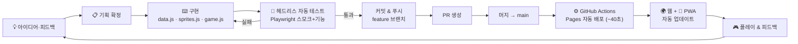
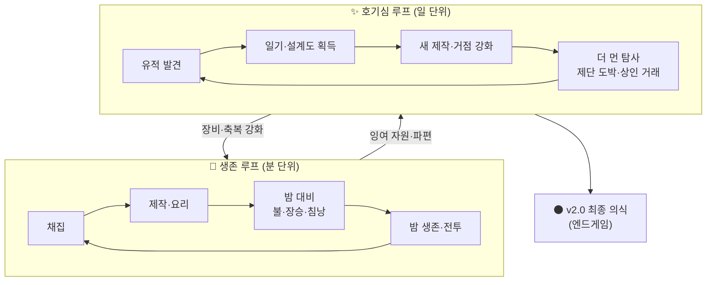
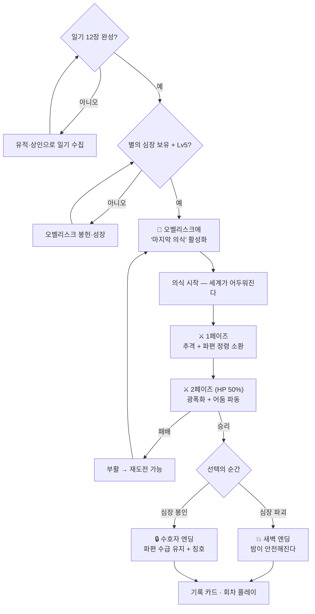

# 야생의 어둠 — 차기 업데이트 기획서

> 작성일: 2026-07-15 · 현재 버전: v1.4 (제단·상인 업데이트) · 배포: [ssooowait-art.github.io/baby-menu-reels](https://ssooowait-art.github.io/baby-menu-reels/)

---

## 1. 현재 상태 요약

| 영역 | 구현 완료 |
|---|---|
| 코어 생존 | 채집 · 제작(20레시피) · 허기/갈증/피로/체온 · 낮밤 주기 |
| 전투 | 정령·늑대(밤), 토끼·멧돼지(낮), 무기 티어(돌→철→어둠의 검) |
| 탐사 | 유적 4종 · 일기 12장 로어 · 설계도 해금 · 별의 심장 |
| 이벤트 | 어둠의 제단(축복/시련) · 방랑 상인 · 날씨(비) |
| 플랫폼 | 픽셀 아트 · PWA 설치 · 오프라인 · 터치 피드백 · 자동 배포 |

**남은 핵심 공백**: 게임의 "끝"이 없다. 일기 12장을 모아도 이야기가 회수되지 않고, 별의 심장의 서사적 무게가 게임플레이로 이어지지 않는다.

---

## 2. 로드맵 (우선순위순)

### 🌑 v2.0 「깨어나는 것」 — 엔드게임 보스 (다음 작업, 최우선)

일기의 떡밥("본체가 눈을 뜨기 전에…")을 회수하는 최종 콘텐츠.

**발동 조건 (전부 충족 시 오벨리스크에 '마지막 의식' 활성화)**
- 일기 12장 완성
- 별의 심장 보유
- 레벨 5 이상

**전투 설계 — 보스: 깨어난 어둠**
| 페이즈 | HP | 패턴 |
|---|---|---|
| 1페이즈 | 150 | 느리게 추격 + 파편 정령 3마리 주기 소환 |
| 2페이즈 (HP 50%) | — | 광폭화: 이속↑, 어둠 파동(원형 범위 공격, 예고 후 발동) |
| 약점 | — | 횃불/화로/등불 빛 반경 안에서는 받는 피해 1.5배 |

**멀티 엔딩 (승리 시 선택)**
- 💥 **심장 파괴**: 어둠 소멸, 밤이 안전해짐(정령 스폰 중단) — "새벽 엔딩"
- 🔒 **심장 봉인**: 밤은 계속되지만 파편 수급 유지 + 수호자 칭호/버프 — "수호자 엔딩"
- 패배 시: 부활 후 재도전 가능 (의식 재시작)

**작업 항목**: 보스 스프라이트(2페이즈)·AI·범위공격 텔레그래프 / 의식 연출(화면 진동·암전) / 엔딩 패널 2종 / 엔딩 후 세계 상태 변화 / 미션 2개 · **예상 규모: 큼**

### 🧭 v2.1 「길잡이」 — QoL & 편의성

- **나침반 HUD**: 미조사 유적·제단·상인 방향 화살표 (미니맵보다 가볍고 픽셀 감성 유지)
- **보관 상자** 제작(통나무2+돌1): 거점 아이템 보관, 인벤토리 압박 해소
- **밸런스 패스**: 후반 식량 루프(밭 자동화 체감), 철 도구 내구도, 늑대 빈도
- **간단 BGM**: WebAudio 루프 2트랙(낮/밤) + 음소거 설정 · **예상 규모: 중간**

### 🏆 v2.2 「기록」 — 공유 & 리플레이 가치 (선택)

- 사망/엔딩 시 **기록 카드**(생존 일수·레벨·파편·엔딩)를 이미지로 저장/공유
- 로컬 최고 기록판, 회차 보너스(2회차 시작 보너스)
- (서버 필요한 글로벌 리더보드는 이 버전에서 제외 — 무서버 원칙 유지) · **예상 규모: 작음**

---

## 3. 개발·배포 워크플로우

현재 확립된 파이프라인. 사람 손은 **피드백 → 지시** 한 곳에만 필요하다.

## 4. 게임플레이 코어 루프

신규 콘텐츠는 이 루프의 바깥 고리(호기심 루프)를 두껍게 만드는 방향으로 추가한다.

## 5. v2.0 보스 이벤트 흐름

---

## 6. 결정 필요 사항

1. **v2.0 엔딩 후 세계**: 새벽 엔딩에서 정령 스폰이 멈추면 파편 경제가 죽는다 → 낮에 희귀 "빛의 조각"으로 대체할지?
2. **보스 난이도**: 1회차 클리어 가능 수준 vs 가죽옷+어둠의 검 필수 수준 (현재 안: 후자)
3. **BGM**: 절차 생성 WebAudio로 갈지, 무음 유지할지 (파일 에셋은 계속 0 유지 원칙)
